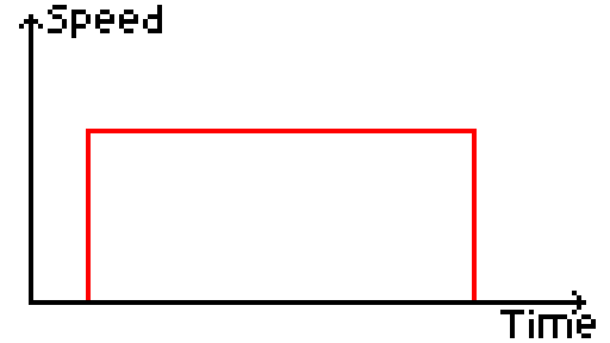
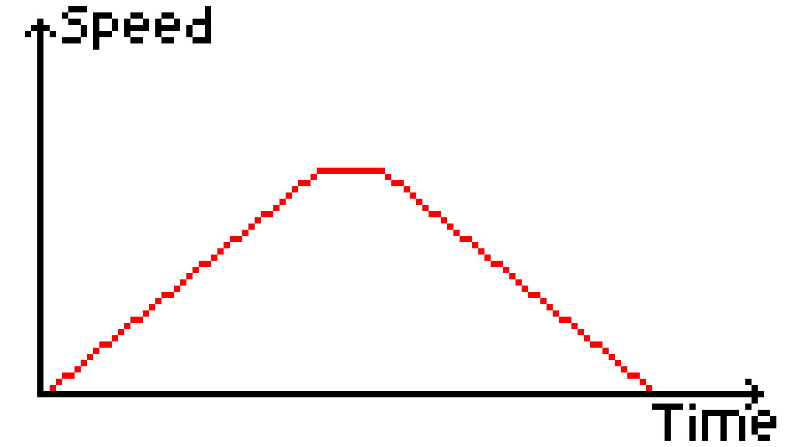
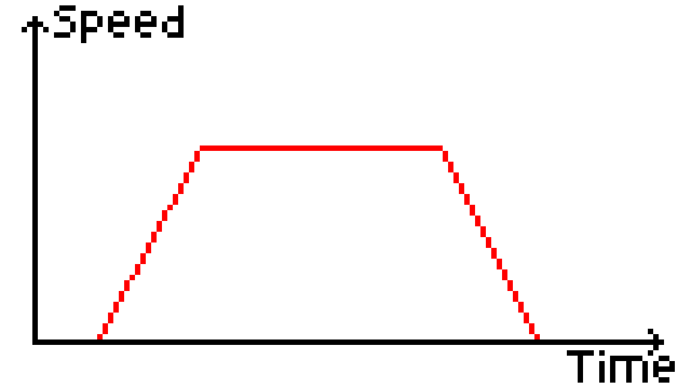
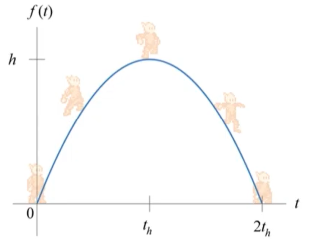
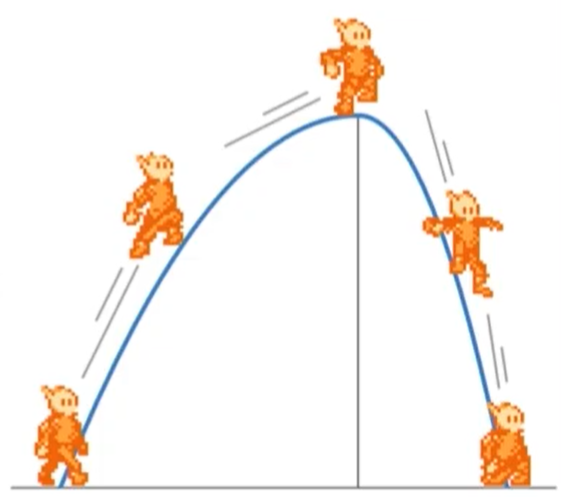
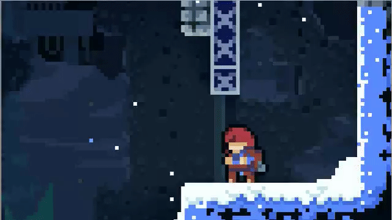
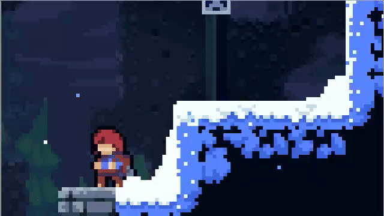

# Notes

All these are things to keep in mind. These are things to adjust per-game and **NOT** something you have to do. Especially for Movement, Jumps, and "Juice" sections

"The movement in a platformer feels natural, but behind the scenes, it’s anything but."

## Design Principles

- Make the platforming feel "natural"
- Make the player feel in control of the movement
  - (So much so that it's ok to "cheat for the player")
- And a tip for beginners: do **NOT** make it **unecessarily** hard. (Players want to have fun)

## The Unique Mechanic

Every platformer needs a unique mechanic

Examples:

- Gravity switch
- Teleportation

## Add Other Movement Options too

Jumping and moving may be good, but is often not enough, so here's some common other movement mechanics

- Climbing
- Wall Jumping
- Dashing
- Double Jump
- The "Pogo" from Hollow Knight

## Movement (Oh no, PHYSICS!?)

The speed curve (adjust this for different feel).

- Instant movement - fighting games and precise movement
  - 

- Slidey movement - ice level kind of stuff
  - 

- In between movement - "the goldilocks amount" b/c it is more natural than instant movement
  - 

## Jumps (Oh no, MORE Physics!?)

The jump curve (adjust this for different kinds of jump feel)

- Real life physics jump (takes the same time to go up than go down)
  - 

- fast fall (makes jumps feel less floaty)
  - 

- you can also make the jump floaty by decreasing the acceleration after reaching the peak of a jump
  - (didn't feel like finding an image for this one)

- Varying heights for jumps can allow player to feel that they can control the height they fall.

## Camera

The player needs to be able to see where they are going.

Different methods of camera movement

- Automatic side scrolling
- Static (doesn't move until the next level)
- Fixed on the player (often the movement of the camera will be damped)

## Assists - "Cheating" for the player

- Coyote Time
  - Give the player an extra time window to jump even if they are no longer touching the ground
  - 

- Jump Buffering - If you press and hold the jump button a short time before landing, you will jump on the exact frame that you land.

- Ceiling Corner Correction
  - If jumping into the corner of a ceiling, nudge player left or right
  - 

- Edge Corner Correction
  - Same idea as ceiling correction, but instead do it horizontally for platforms.
  - 

- Having a max X or Y velocity makes it so the player will never go too fast

## "Juice" - The "impact" of movement

- Particles - when running, landing, or jumping
- Sounds - when running, landing, or jumping
- Animations - when running, landing or jumping
- Stretching the character in the direction they are moving
- Slightly tilting character when they run
- Afterimage of the character if they move *super* fast

Don't over do it, but can really make the player feel like they are actually moving a real character

## TL;DR

To make a good platformer...

- Make the movement feel natural
- Be forgiving to the player

